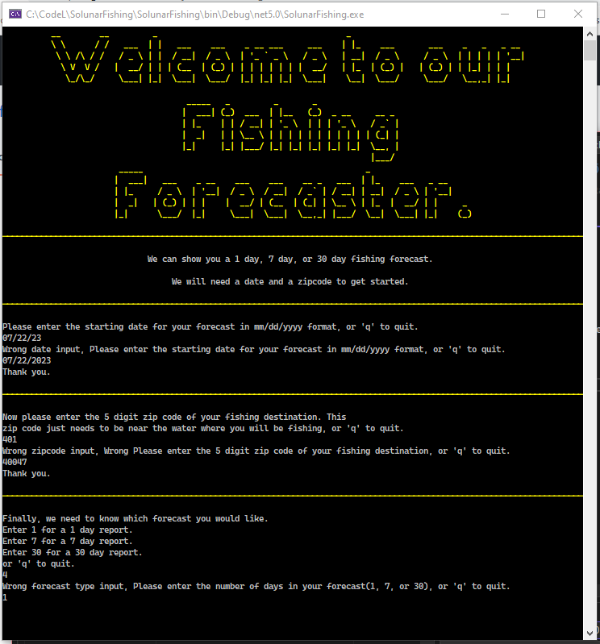
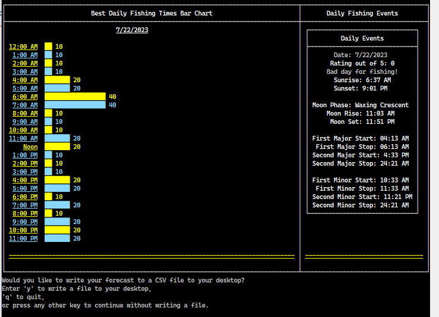

## Solunar Fishing Forecast

This project will provide a one day, 7 day or 30 day fishing forecast based on the Solunar Theory.

The app will ask the user for a zipcode, date and whether they want a 1, 7 or 30 day fishing forecast.  It will then access a json file that uses linq to search for the zip code and return longitude and latitude.  Then it uses longitude,  latitude and date to access an api via the internet that has solunar fishing data by date.  

The app will collect 1, 7 or 30 days of data and return it to the user in a pleasant usable format that shows the best hours and days to fish for  that zipcode.  

---

### Opening Console Screen - User Input

---

### Solunar Forecast Screen

This screen shows a graph of how good fishing will be by the hour of the requested day in the chart on the right.  The table on the left has a daily fishing rating on a scale from 0 to 5.  It also lists sunrise, sunset, moonrise and moonset times for the day.  It also displays the best times during the day to go fishing based on solunar theory.

---

This project is uploaded to a GitHub repository and shows at minimum 5 separate commits.

The feature list is as follows:

1.  Created at least one class with an object of that class and populated it with data. This is the forecast displayed on the console.
2.  Create and call at least 3 functions or methods, at least one of which must return a value that is used in your application.
3.  Implement a master loop console application where the user can repeatedly enter commands/perform actions, including choosing to exit the program.
4.  Create a dictionary or list, populate it with several values, retrieve at least one value, and use it in your program.
5.  Read data from an external file, such as text, JSON, CSV, etc and use that data in your application.
6.  Implement a regular expression (regex) to ensure a field, either a phone number or an email address is always stored and displayed in the same format.
7.  Connect to an external/3rd party API and read data into your app.
8.  Use a LINQ query to retrieve information from a data structure (such as a list or array) or file.
9.  Build a conversion tool that converts user input to another type and displays it (ex: converts 24 hours to 12 hour time).
10.  Visualize data in a graph, chart, or other visual representation of data.